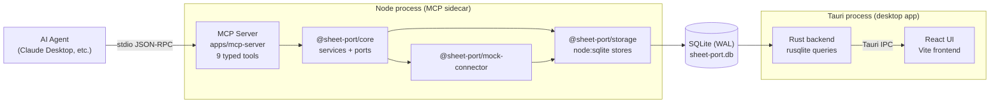
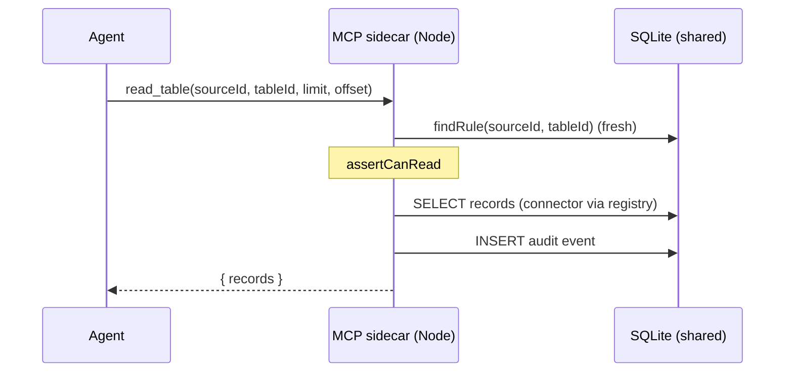

# Architecture

## High-Level Architecture

Airtable - Sheet Port runs as two local processes that share one SQLite database:

- The Tauri desktop app (`apps/desktop`): a Rust backend (rusqlite) plus a React frontend.
  It owns permission editing, change approval, the audit log UX, and token status.
- The Node MCP sidecar (`apps/mcp-server`): a stdio MCP server exposing 9 typed tools
  to agents. It enforces permissions and the preview -> approve -> commit flow.

There is no direct IPC between the two processes. All shared state (sources, permission
rules, pending changes, audit events, mock data, sidecar heartbeat) lives in the SQLite
file, and each process reads fresh state on every call. `docs/ipc.md` is the canonical
contract for the Tauri commands and the confirmation-enforcement flow.



## Shared SQLite State Model

Defined canonically in `docs/ipc.md`:

- Path: `%APPDATA%/sheet-port/sheet-port.db` (Windows),
  `~/Library/Application Support/sheet-port/sheet-port.db` (macOS),
  `$XDG_DATA_HOME/sheet-port/sheet-port.db` or `~/.local/share/sheet-port/sheet-port.db` (Linux).
- Env override: `SHEET_PORT_DB` (absolute file path), used by tests and smoke scripts.
- Schema `packages/storage/schema.sql` and seed `packages/storage/seed.sql` are the
  single source of truth. Rust embeds both via `include_str!`; the Node side ships a
  verbatim copy in `packages/storage/src/sql.ts`. Whichever process opens the DB first
  applies schema + seed; both are idempotent.
- Connection pragmas on every connection: `journal_mode=WAL`, `busy_timeout=5000`,
  `foreign_keys=ON`.

Tables: `meta`, `sources`, `permission_rules`, `pending_changes`, `audit_events`,
`mcp_heartbeat`, `mock_tables`, `mock_records`.

## Heartbeat Status

The desktop app never spawns or polls the sidecar directly; liveness flows through the DB:

- On startup the sidecar deletes `mcp_heartbeat` rows older than 30s
  (`HEARTBEAT_STALE_MS`) left behind by crashed processes, then upserts its own row
  keyed by pid.
- Every 10s (`HEARTBEAT_INTERVAL_MS`) it refreshes `last_seen`. The timer is unref'd so
  it never keeps the process alive.
- On `SIGINT`/`SIGTERM`/`exit` it deletes its own row (best effort).
- The desktop `get_app_status` command reports `mcpRunning: true` when any heartbeat row
  has `last_seen` within 30s, plus `mcpPid` and `mcpLastSeen`.

## Package Layout

```txt
apps/
  desktop/            React/Vite frontend + Tauri 2 Rust backend
  mcp-server/         Node MCP sidecar (stdio transport)
packages/
  shared/             Types shared across TS packages + BULK_UPDATE_THRESHOLD
  core/               Domain services and storage ports
  storage/            SQLite layer (node:sqlite) + schema.sql + seed.sql
  ui/                 Small UI helpers
  connectors/
    mock/             SQLite-backed mock connector
    google-sheets/    Skeleton (OAuth and range mapping TODO)
    provider/         Skeleton (additional provider TODO)
```

## MCP Sidecar

`apps/mcp-server` uses stdio transport and registers exactly these tools
(see `docs/mcp-tools.md` for the full reference):

`list_sources`, `list_tables`, `describe_table`, `read_table`, `find_records`,
`preview_update_records`, `append_records`, `commit_change`, `get_audit_log`.

`src/context.ts` wires the services to the shared DB: `ConnectorRegistry` resolves the
connector by the `sources.kind` column, `PermissionService` reads rules through
`PermissionStore`, `ChangeService` persists through `ChangeStore`, `AuditService`
through `AuditStore`, and `HeartbeatStore` maintains the liveness row. It does not
expose shell execution, JavaScript execution, provider tokens, or raw provider APIs.

## Core Package

`packages/core` contains domain services and the ports that `packages/storage`
implements:

- `ConnectorRegistry`: routes calls to connectors; resolves a source id to a connector
  kind via an injected `ResolveSourceKind` lookup (backed by the `sources` table).
- `PermissionService` (+ `PermissionRuleProvider` port): evaluates read/write/delete and
  confirmation requirements. Rules are read fresh on every evaluation, so desktop edits
  apply to the sidecar immediately. A table-specific rule wins over a source-wide rule.
- `ChangeService` (+ `ChangeStorePort` port): creates pending changes with diffs and
  enforces the commit flow, including atomic guarded status transitions.
- `AuditService` (+ `AuditStorePort` port): records security-relevant events.
- `SchemaService`: in-process schema cache and field validation helper.

## Storage Package

`packages/storage` implements the core ports on `node:sqlite` (`DatabaseSync`):

- `openSheetPortDb` / `resolveDbPath`: pragmas, schema + seed, per-OS path resolution.
- Stores: `SourceStore`, `PermissionStore`, `ChangeStore`, `AuditStore`,
  `MockDataStore`, `HeartbeatStore`.
- `SCHEMA_SQL` / `SEED_SQL`: embedded copies of the shared SQL files.
- Constants: `HEARTBEAT_INTERVAL_MS` (10s), `HEARTBEAT_STALE_MS` (30s),
  `CHANGE_LIST_LIMIT` (200).

## Desktop App

### Rust backend (`apps/desktop/src-tauri`)

| Module | Responsibility |
|---|---|
| `main.rs` | Binary entry point; delegates to `lib.rs`. |
| `lib.rs` | Tauri builder, DB state setup, command registration. |
| `db.rs` | Path resolution (`SHEET_PORT_DB` override), pragmas, `include_str!` of schema + seed, `now_iso`. |
| `queries.rs` | All SQL: status, sources, tables, records, permission rules, changes (guarded transitions), audit events. |
| `commands.rs` | Thin `#[tauri::command]` wrappers matching `docs/ipc.md`, plus the keyring stub (`token_status`). |
| `models.rs` | Serde structs with `rename_all = "camelCase"` matching the TS types. |
| `queries_tests.rs` | Unit tests against temp-file databases. |

### React frontend (`apps/desktop/src`)

- Screens: Dashboard, Data Sources, Tables, Permissions, Changes, Audit Log.
- `lib/ipc.ts` types every Tauri command from `docs/ipc.md`; when the app runs in a
  plain browser (no Tauri), it falls back to in-memory demo fixtures for UI preview.
- Server state via TanStack Query; tables via TanStack Table.
- The window runs with `decorations: false`; `components/Titlebar.tsx` renders a custom
  titlebar using `data-tauri-drag-region` and the window API (minimize /
  toggle-maximize / close), granted through `src-tauri/capabilities/default.json`.

## Read Flow



## Preview -> Approve -> Commit Flow

Both processes participate; the shared DB is the only coordination point.
The desktop `approve_change`/`reject_change` and the sidecar's transitions all use
atomic guarded UPDATEs (`... WHERE id = ? AND status = ?`), so concurrent decisions
cannot double-apply.

```mermaid
sequenceDiagram
  participant A as Agent
  participant M as MCP sidecar (Node)
  participant DB as SQLite (shared)
  participant R as Tauri backend (Rust)
  participant U as User (desktop UI)

  A->>M: preview_update_records(patches)
  M->>DB: findRule (fresh) - read gate + write policy
  Note over M: action = patches > 20 ? bulk_update : update
  M->>DB: INSERT pending_changes (status=pending,<br/>requires_confirmation from rule)
  M-->>A: { change, diff, requiresConfirmation }

  U->>R: approve_change(changeId)
  R->>DB: UPDATE pending_changes SET status='approved'<br/>WHERE id=? AND status='pending'
  R->>DB: INSERT audit event (actor=user)
  R-->>U: approved change

  A->>M: commit_change(changeId)
  M->>DB: SELECT change (fresh status)
  Note over M: rejected/committed -> error;<br/>requires_confirmation and not approved -> error
  M->>DB: findRule (fresh) - permission re-check
  Note over M: if no confirmation required:<br/>UPDATE pending->approved (decided_by='policy')
  M->>DB: connector write (mock_records)
  M->>DB: UPDATE approved->committed (guarded)
  M->>DB: INSERT audit event (actor=agent)
  M-->>A: { change: committed, records }
```

## Current Limitations

- Only the mock connector is functional; Google Sheets and the additional provider
  packages are skeletons that throw on use.
- No real OAuth: `token_status` reads an OS keyring stub (service `sheet-port`) and no
  flow ever writes tokens yet.
- Delete changes are typed in the schema but not implemented end to end (no delete tool,
  `ChangeService` refuses delete payloads).
- The SQLite file is unencrypted at rest.
- The desktop app does not manage the sidecar lifecycle; agents' MCP clients spawn it.
