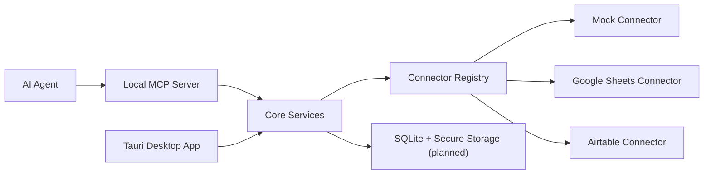
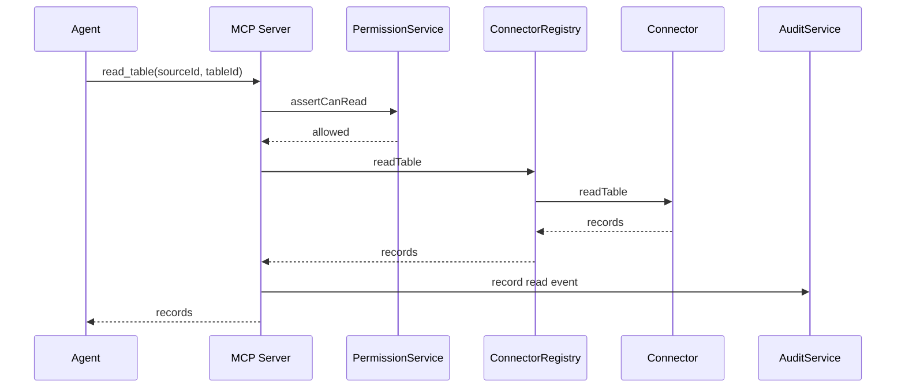
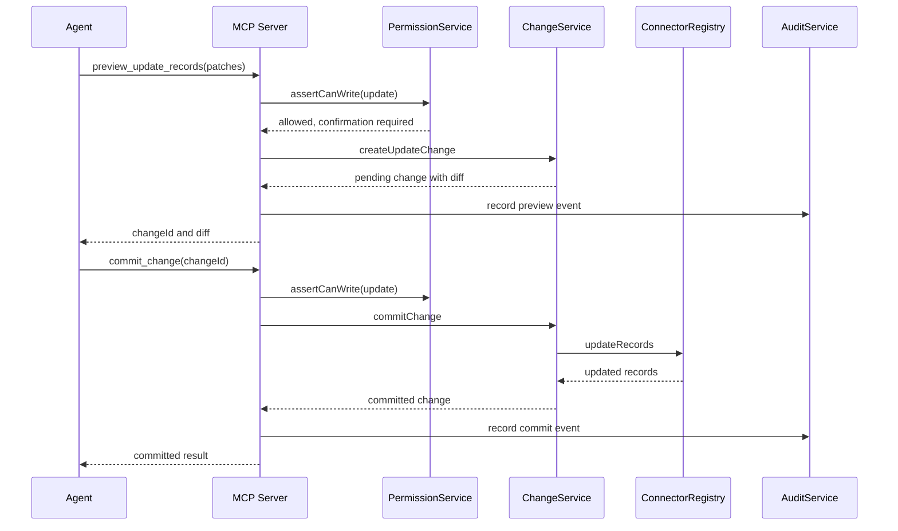

# Architecture

## High-Level Architecture

Sheet Port is a local desktop app plus a local MCP sidecar. The desktop app owns identity, policy, approval, and audit UX. The MCP sidecar exposes a small set of table tools to agents and delegates all domain decisions to shared core services.

## Desktop App

The desktop app is a React/Vite/Tauri shell. The initial UI shows:

- Dashboard with MCP and connector state.
- Data Sources with Google Sheets and Airtable placeholders.
- Tables with mock table preview.
- Permissions editor for base rule shape.
- Changes screen for pending diffs and mock approvals.
- Audit Log for tool calls and write actions.

Future Tauri commands will start, stop, and monitor the MCP sidecar and expose local persisted state to the UI.

## MCP Server

The MCP server uses stdio transport by default. It exposes only allowlisted tools with zod schemas:

- `list_sources`
- `list_tables`
- `describe_table`
- `read_table`
- `find_records`
- `preview_update_records`
- `append_records`
- `commit_change`
- `get_audit_log`

It does not expose shell execution, JavaScript execution, provider tokens, or raw provider API calls.

## Core Package

The core package contains domain services:

- `ConnectorRegistry`: routes calls to connectors by source kind and source id.
- `PermissionService`: evaluates read/write/delete and confirmation requirements.
- `AuditService`: records security-relevant events.
- `ChangeService`: creates and commits pending changes.
- `SchemaService`: caches and validates table schemas.

## Connector Layer

Connectors implement a table abstraction rather than provider-specific APIs. The mock connector is complete enough for development. Google Sheets and Airtable packages currently define the boundary and TODOs for auth and mapping.

## Data Flow

## Preview to Commit Flow

## Current Limitations

- Persistence is in-memory.
- Desktop approval and MCP pending-change state are not yet connected across processes.
- Tauri sidecar packaging is scaffolded but not complete.
