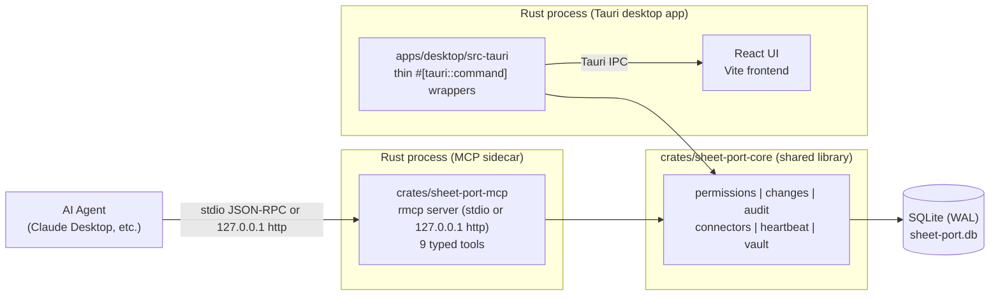
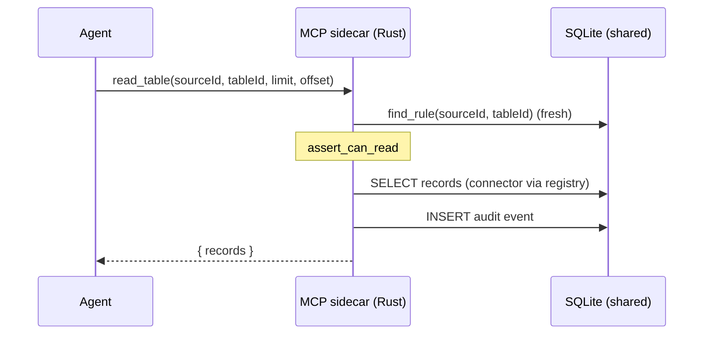

# Architecture

## High-Level Architecture

Airtable - Sheet Port runs as two local Rust processes that share one SQLite database
and one core crate:

- The Tauri desktop app (`apps/desktop`): a thin Rust shell (`src-tauri`) plus a React
  frontend. It owns permission editing, change approval, the audit log UX, token
  status, and app settings (theme).
- The Rust MCP sidecar (`crates/sheet-port-mcp`): an MCP server exposing 9 typed tools
  to agents. It enforces permissions and the preview -> approve -> commit flow. It serves
  either the default stdio transport or an optional loopback HTTP transport (see
  "MCP Transports" below).

Both processes are wrappers over `crates/sheet-port-core`, which owns every broker
behavior: shared SQLite access, permission rules, the pending-change lifecycle, audit,
connectors, the heartbeat, and the keychain vault. The trust surface is a single
language: no JavaScript runs anywhere in the broker path (TypeScript remains only in
the desktop frontend).

There is no direct IPC between the two processes. All shared state (sources, permission
rules, pending changes, audit events, mock data, sidecar heartbeat) lives in the SQLite
file, and each process reads fresh state on every call. `docs/ipc.md` is the canonical
contract for the Tauri commands and the confirmation-enforcement flow.



## Shared SQLite State Model

Defined canonically in `docs/ipc.md`:

- Path: `%APPDATA%/sheet-port/sheet-port.db` (Windows),
  `~/Library/Application Support/sheet-port/sheet-port.db` (macOS),
  `$XDG_DATA_HOME/sheet-port/sheet-port.db` or `~/.local/share/sheet-port/sheet-port.db` (Linux).
- Env override: `SHEET_PORT_DB` (absolute file path), used by tests and smoke scripts.
- Schema `crates/sheet-port-core/sql/schema.sql` and seed
  `crates/sheet-port-core/sql/seed.sql` are the single source of truth, embedded once
  via `include_str!` in `db.rs` and therefore shared by both processes. Whichever
  process opens the DB first applies schema + seed; the schema is idempotent and the
  seed is guarded by the `meta` key `seeded`, so user deletions of seed rows survive
  restarts.
- Connection pragmas on every connection: `journal_mode=WAL`, `busy_timeout=5000`,
  `foreign_keys=ON`.

Tables: `meta`, `sources`, `permission_rules`, `pending_changes`, `audit_events`,
`mcp_heartbeat`, `mock_tables`, `mock_records`.

## Heartbeat Status

The desktop app never spawns or polls the sidecar directly; liveness flows through the DB:

- On startup the sidecar deletes `mcp_heartbeat` rows older than 30s
  (`HEARTBEAT_STALE_MS`) left behind by crashed processes, then upserts its own row
  keyed by pid.
- A tokio background task refreshes `last_seen` every 10s (`HEARTBEAT_INTERVAL_MS`).
- On shutdown (transport closed, Ctrl+C, or SIGTERM on Unix) it deletes its own row
  (best effort).
- The desktop `get_app_status` command reports `mcpRunning: true` when the newest
  heartbeat row has `last_seen` within 30s, plus `mcpPid` and `mcpLastSeen` (reported
  even when stale so the UI can show when the sidecar was last alive).

## Workspace Layout

The Rust workspace (root `Cargo.toml`) has three members; pnpm manages only the
frontend packages.

```txt
crates/
  sheet-port-core/    Broker core library (all logic, sql/ schema + seed, 78 unit tests)
  sheet-port-mcp/     Stdio MCP sidecar binary (rmcp, 14 unit tests)
apps/
  desktop/            React/Vite frontend + Tauri 2 Rust shell (src-tauri)
packages/
  shared/             TypeScript types for the frontend (mirrors docs/ipc.md)
  ui/                 Small React UI primitives (Radix-based)
scripts/
  e2e-smoke.mjs       Protocol-level MCP smoke test (spawns the sidecar binary)
```

## Core Crate (`crates/sheet-port-core`)

| Module | Responsibility |
|---|---|
| `db.rs` | Path resolution (`SHEET_PORT_DB` override), pragmas, `include_str!` of `sql/schema.sql` + `sql/seed.sql`, seed guard, `now_iso`. |
| `types.rs` | Serde models with `rename_all = "camelCase"` matching the TypeScript types in `packages/shared` and `docs/ipc.md`. |
| `permissions.rs` | Rule lookup (table-specific beats source-wide), read/write/delete evaluation with `bulk_update` escalation, rule CRUD for the desktop; rules are read fresh on every evaluation. |
| `changes.rs` | Pending-change lifecycle: preview diffs, atomic guarded status transitions, desktop approve/reject, commit with permission re-check; the internal `payload` column never leaves the crate. |
| `audit.rs` | Audit event recording and bounded listing. |
| `connectors/` | `TableConnector` trait, `ConnectorRegistry` (routes by `sources.kind`), the SQLite-backed mock connector, and the Google Sheets / provider stubs. |
| `mock_data.rs` | Mock table/record storage shared by the desktop UI and the sidecar. |
| `sources.rs` | `sources` table access, including kind lookup for the registry. |
| `heartbeat.rs` | Heartbeat upsert/cleanup and the desktop status readout. |
| `vault.rs` | OS keychain token presence checks (service `sheet-port`); only booleans leave the module. |
| `constants.rs` | Contract constants (`BULK_UPDATE_THRESHOLD`, limits, heartbeat timings). |

## MCP Sidecar (`crates/sheet-port-mcp`)

A stdio MCP server built on `rmcp` that registers exactly these tools
(see `docs/mcp-tools.md` for the full reference):

`list_sources`, `list_tables`, `describe_table`, `read_table`, `find_records`,
`preview_update_records`, `append_records`, `commit_change`, `get_audit_log`.

| Module | Responsibility |
|---|---|
| `main.rs` | Entry point: opens the shared DB, resolves the transport config, serves stdio or HTTP, runs the heartbeat task, cleans up on shutdown. For stdio, stdout belongs to the MCP transport; diagnostics go to stderr on both transports. |
| `http.rs` | Optional loopback HTTP transport: binds `127.0.0.1:{port}` and serves rmcp's streamable-http `tower` service over hyper. Same `SheetPortServer` and broker state as stdio. |
| `server.rs` | rmcp glue: the `#[tool]` registrations, read-only annotations, and mapping `CoreError` onto MCP tool errors (`isError: true` with the plain message). |
| `tools.rs` | The 9 tool implementations: permission checks, connector routing through the registry, audit events, pretty-printed JSON outputs. |
| `args.rs` | Input models (JSON schemas via `schemars`) and bounds validation (list sizes 1-100, page limits 1-500, query 1-200 chars). |
| `state.rs` | `BrokerState`: the single SQLite connection behind a mutex plus the connector registry. |

It does not expose shell execution, JavaScript execution, provider tokens, or raw
provider APIs.

### MCP Transports

The sidecar reads its transport and port ONCE at startup from the shared `meta` table
(keys `mcp_transport` and `mcp_port`), or from the `SHEET_PORT_MCP_TRANSPORT` /
`SHEET_PORT_MCP_PORT` env overrides used by tests. Changing the setting therefore
requires a sidecar restart to take effect; the desktop `set_mcp_transport` /
`set_mcp_port` commands only persist config.

| Transport | Default | Wire | Binding |
|---|---|---|---|
| `stdio` | yes | JSON-RPC over stdin/stdout, spawned by the agent's MCP client | none (no port) |
| `http` | no | rmcp streamable-http (`tower` service over hyper) | `127.0.0.1:{port}` only (default 4319, range 1024-65535) |

Both transports serve the identical `SheetPortServer`, share the same `BrokerState`, and
run the same heartbeat - only the wire differs. The HTTP transport binds loopback
exclusively (never `0.0.0.0`) and keeps rmcp's loopback-only `allowed_hosts` default; a
port already in use makes the sidecar log to stderr and exit non-zero. See
`docs/security.md` for the full rationale.

The desktop `get_mcp_config` command reports the persisted `transport`/`port` plus a live
`running` flag (from the heartbeat) and `boundPort` (the configured port while an HTTP
sidecar is running, else null); see `docs/ipc.md`.

## Desktop App

### Rust shell (`apps/desktop/src-tauri`)

| Module | Responsibility |
|---|---|
| `main.rs` | Binary entry point; delegates to `lib.rs`. |
| `lib.rs` | Tauri builder, DB state setup (via `sheet_port_core::db`), command registration. |
| `commands.rs` | Thin `#[tauri::command]` wrappers matching `docs/ipc.md`; each locks the shared connection and delegates to `sheet-port-core` (queries, transitions, keyring `token_status`). |

All SQL, models, and business rules live in the core crate; the shell contains no
broker logic of its own.

### React frontend (`apps/desktop/src`)

- Screens: Dashboard, Data Sources, Tables, Permissions, Changes, Audit Log, Settings.
- Settings owns the dual theme: Light / Dark / System, persisted under the
  `sheet-port-theme` localStorage key, applied by an inline bootstrap script in
  `index.html` to avoid a flash, and live-updated when the OS scheme changes.
- `lib/ipc.ts` types every Tauri command from `docs/ipc.md`; when the app runs in a
  plain browser (no Tauri), it falls back to in-memory demo fixtures for UI preview.
- Server state via TanStack Query; tables via TanStack Table.
- The window runs with `decorations: false`; `components/Titlebar.tsx` renders a custom
  titlebar using `data-tauri-drag-region` and the window API (minimize /
  toggle-maximize / close), granted through `src-tauri/capabilities/default.json`.

## Read Flow



## Preview -> Approve -> Commit Flow

Both processes participate; the shared DB is the only coordination point.
The desktop `approve_change`/`reject_change` and the sidecar's transitions all use
atomic guarded UPDATEs (`... WHERE id = ? AND status = ?`) implemented once in
`changes.rs`, so concurrent decisions cannot double-apply.

```mermaid
sequenceDiagram
  participant A as Agent
  participant M as MCP sidecar (Rust)
  participant DB as SQLite (shared)
  participant R as Tauri shell (Rust)
  participant U as User (desktop UI)

  A->>M: preview_update_records(patches)
  M->>DB: find_rule (fresh) - read gate + write policy
  Note over M: action = patches > 20 ? bulk_update : update
  M->>DB: INSERT pending_changes (status=pending,<br/>requires_confirmation from rule)
  M-->>A: { change, diff, requiresConfirmation }

  U->>R: approve_change(changeId)
  R->>DB: UPDATE pending_changes SET status='approved'<br/>WHERE id=? AND status='pending'
  R->>DB: INSERT audit event (actor=user)
  R-->>U: approved change

  A->>M: commit_change(changeId)
  M->>DB: SELECT change (fresh status)
  Note over M: rejected/committed -> error;<br/>requires_confirmation and not approved -> error
  M->>DB: find_rule (fresh) - permission re-check
  Note over M: if no confirmation required:<br/>UPDATE pending->approved (decided_by='policy')
  M->>DB: connector write (mock_records)
  M->>DB: UPDATE approved->committed (guarded)
  M->>DB: INSERT audit event (actor=agent)
  M-->>A: { change: committed, records }
```

## Current Limitations

- Only the mock connector is functional; the Google Sheets and provider connectors are
  stubs that return explicit "not implemented" errors, and only the mock connector is
  registered in `ConnectorRegistry::with_default_connectors`.
- No real OAuth: `token_status` reads an OS keyring stub (service `sheet-port`) and no
  flow ever writes tokens yet.
- Delete changes are typed in the schema but not implemented end to end (no delete tool,
  the commit path refuses delete payloads).
- The SQLite file is unencrypted at rest.
- The desktop app does not manage the sidecar lifecycle; agents' MCP clients spawn it.
