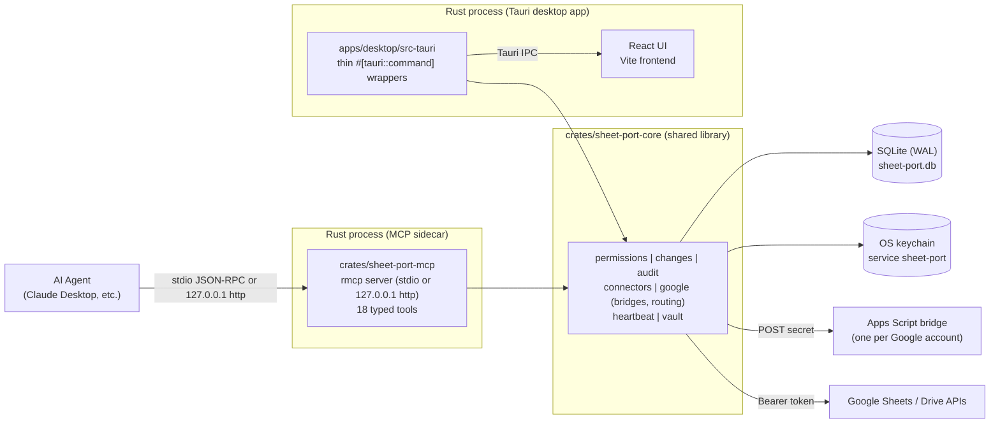
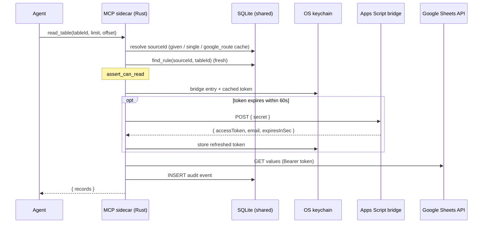
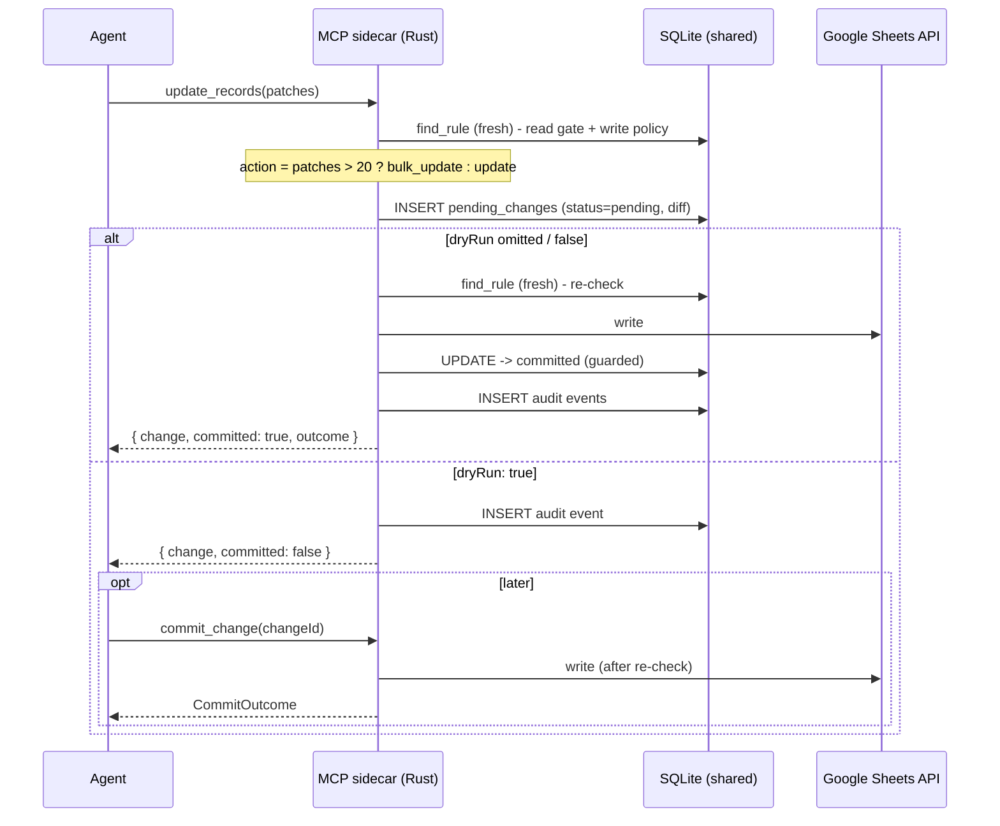

# Architecture

## High-Level Architecture

Airtable - Sheet Port runs as two local Rust processes that share one SQLite database,
the OS keychain, and one core crate:

- The Tauri desktop app (`apps/desktop`): a thin Rust shell (`src-tauri`) plus a React
  frontend. It manages Google bridges, permission rules, the audit
  log, the spreadsheet workbench, MCP client registration, and app settings.
- The Rust MCP sidecar (`crates/sheet-port-mcp`): an MCP server exposing 18 typed tools
  to agents. It enforces permissions and runs the staged-change pipeline. It serves
  either the default stdio transport or an optional loopback HTTP transport (see
  "MCP Transports" below).

Google access goes through Apps Script bridges (`bridge/`) that the user deploys on each
Google account. A bridge trades a shared secret for a short-lived OAuth access token;
both processes then call the Google Sheets and Drive REST APIs directly with that token.

Both processes are wrappers over `crates/sheet-port-core`, which owns every broker
behavior: shared SQLite access, permission rules, the change lifecycle, audit,
connectors, bridge/token handling, account routing, the heartbeat, and the keychain
vault. The trust surface is a single language: no JavaScript runs anywhere in the broker
path (TypeScript remains only in the desktop frontend).

There is no direct IPC between the two processes. All shared state (sources, permission
rules, changes, audit events, route cache, sidecar heartbeat) lives in the SQLite file,
bridge credentials live in the OS keychain, and each process reads fresh state on every
call. The sidecar therefore works with the desktop app closed. `docs/ipc.md` is the
canonical contract for the Tauri commands.


```mermaid
flowchart LR
  Agent["AI Agent<br/>(Claude Desktop, etc.)"]
  DB[("SQLite (WAL)<br/>sheet-port.db")]
  KC[("OS keychain<br/>service sheet-port")]
  Bridge["Apps Script bridge<br/>(one per Google account)"]
  Google["Google Sheets / Drive APIs"]

  subgraph Sidecar["Rust process (MCP sidecar)"]
    MCP["crates/sheet-port-mcp<br/>rmcp server (stdio or 127.0.0.1 http)<br/>18 typed tools"]
  end

  subgraph Core["crates/sheet-port-core (shared library)"]
    Logic["permissions | changes | audit<br/>connectors | google (bridges, routing)<br/>heartbeat | vault"]
  end

  subgraph Desktop["Rust process (Tauri desktop app)"]
    Rust["apps/desktop/src-tauri<br/>thin #[tauri::command] wrappers"]
    React["React UI<br/>Vite frontend"]
  end

  Agent -->|stdio JSON-RPC or 127.0.0.1 http| MCP
  MCP --> Logic
  Rust --> Logic
  Logic --> DB
  Logic --> KC
  Logic -->|POST secret| Bridge
  Logic -->|Bearer token| Google
  Rust -->|Tauri IPC| React
```

## Google Bridges and Accounts

- A bridge is `{bridgeUrl, secret, deploymentId}` (deploymentId parsed from the `/exec`
  URL) plus a cached access token and expiry, stored as one keychain entry: service
  `sheet-port`, user `google_sheets:{accountKey}`, where accountKey is the sanitized
  email the bridge reports.
- Each account is one source row, id `google-sheets:{accountKey}`, kind `google_sheets`.
  Adding a bridge whose email already exists replaces that account's entry.
- Access tokens come from `POST {bridgeUrl}` with `{ "secret": ... }`. The cached token
  is reused until it is within 60 seconds of expiry, then re-fetched. Either process can
  refresh it; the keychain is the shared cache.
- New bridge sources get a source-wide permission rule with read, write and delete
  allowed.

## Account Routing

`sourceId` is optional on every tool. Resolution (in the core crate, shared by both
processes):

1. `sourceId` given -> use it.
2. One account connected -> use it.
3. Several accounts and the call references a spreadsheet -> read
   `meta.google_route:{spreadsheetId}`; on a miss, probe each account with
   `GET spreadsheets/{id}?fields=spreadsheetId`, take the first that succeeds, and cache
   the pair.
4. Nothing referenced -> the first account.

## Shared SQLite State Model

Defined canonically in `docs/ipc.md`:

- Path: `%APPDATA%/sheet-port/sheet-port.db` (Windows),
  `~/Library/Application Support/sheet-port/sheet-port.db` (macOS),
  `$XDG_DATA_HOME/sheet-port/sheet-port.db` or `~/.local/share/sheet-port/sheet-port.db` (Linux).
- Env override: `SHEET_PORT_DB` (absolute file path), used by tests and smoke scripts.
- Schema `crates/sheet-port-core/sql/schema.sql` and seed
  `crates/sheet-port-core/sql/seed.sql` are the single source of truth, embedded once
  via `include_str!` in `db.rs` and therefore shared by both processes. Whichever
  process opens the DB first applies schema + seed; fresh databases start empty (no
  sources) until the user adds a bridge.
- Connection pragmas on every connection: `journal_mode=WAL`, `busy_timeout=5000`,
  `foreign_keys=ON`.

Tables: `meta`, `sources`, `permission_rules`, `pending_changes`, `audit_events`,
`mcp_heartbeat`, `workbench_folders`, `workbench_items`, plus `mock_tables` /
`mock_records`, which only the `mock` feature uses.

## Heartbeat Status

The desktop app never polls the sidecar directly; liveness flows through the DB:

- On startup the sidecar deletes `mcp_heartbeat` rows older than 30s
  (`HEARTBEAT_STALE_MS`) left behind by crashed processes, then upserts its own row
  keyed by pid.
- A tokio background task refreshes `last_seen` every 10s (`HEARTBEAT_INTERVAL_MS`).
- On shutdown (transport closed, Ctrl+C, or SIGTERM on Unix) it deletes its own row
  (best effort).
- The desktop `get_app_status` command reports `mcpRunning: true` when the newest
  heartbeat row has `last_seen` within 30s, plus `mcpPid` and `mcpLastSeen`.

## Workspace Layout

The Rust workspace (root `Cargo.toml`) has three members; pnpm manages only the
frontend packages.

```txt
bridge/               Apps Script bridge (Code.gs, appsscript.json, setup README)
crates/
  sheet-port-core/    Broker core library (all logic, sql/ schema + seed)
  sheet-port-mcp/     MCP sidecar binary (rmcp, stdio + loopback http)
apps/
  desktop/            React/Vite frontend + Tauri 2 Rust shell (src-tauri)
packages/
  shared/             TypeScript types for the frontend (mirrors docs/ipc.md)
  ui/                 Small React UI primitives (Radix-based)
scripts/
  e2e-smoke.mjs       Protocol-level MCP smoke test (spawns the sidecar binary)
  stage-sidecar.mjs   Builds the sidecar and stages it as the Tauri externalBin
```

## Core Crate (`crates/sheet-port-core`)

| Module | Responsibility |
|---|---|
| `db.rs` | Path resolution (`SHEET_PORT_DB` override), pragmas, `include_str!` of `sql/schema.sql` + `sql/seed.sql`, migrations, meta settings, `now_iso`. |
| `types.rs` | Serde models with `rename_all = "camelCase"` matching the TypeScript types in `packages/shared` and `docs/ipc.md`. |
| `permissions.rs` | Rule lookup (table-specific beats source-wide), read/write/delete evaluation with `bulk_update` escalation, rule CRUD for the desktop; rules are read fresh on every evaluation. |
| `changes.rs` | Change lifecycle: staging with diffs, stage-and-commit, commit with permission re-check, discard, atomic guarded status transitions; the internal `payload` column never leaves the crate. |
| `audit.rs` | Audit event recording and bounded listing. |
| `connectors/` | `TableConnector` trait, `ConnectorRegistry` (routes by `sources.kind`), the Google Sheets connector, and the SQLite-backed mock connector (feature `mock` only). |
| `google/` | Bridge client (secret -> token), keychain-backed bridge records and token cache, account listing, add/remove/test, and account routing with the `google_route:*` cache. Raw tokens and secrets never leave this module. |
| `sources.rs` | `sources` table access, including kind lookup for the registry. |
| `workbench.rs` | The desktop spreadsheet workbench (folders, items, direct grid reads/writes). |
| `mcp_clients.rs` | Detects MCP clients and merges/removes our server entry in their configs. |
| `heartbeat.rs` | Heartbeat upsert/cleanup and the desktop status readout. |
| `vault.rs` | OS keychain access (service `sheet-port`); only booleans leave the module for status. |
| `constants.rs` | Contract constants (`BULK_UPDATE_THRESHOLD`, limits, heartbeat timings). |

## MCP Sidecar (`crates/sheet-port-mcp`)

An MCP server built on `rmcp` that registers exactly these tools (see
`docs/mcp-tools.md` for the full reference):

`list_sources`, `list_tables`, `list_sheets`, `describe_table`, `read_table`,
`read_formulas`, `find_records`, `read_cells`, `get_table_style`, `update_records`,
`append_records`, `update_cells`, `format_table`, `create_spreadsheet`, `create_sheet`,
`delete_sheet`, `commit_change`, `get_audit_log`.

| Module | Responsibility |
|---|---|
| `main.rs` | Entry point: opens the shared DB, resolves the transport config, serves stdio or HTTP, runs the heartbeat task, cleans up on shutdown. |
| `http.rs` | Optional loopback HTTP transport: binds `127.0.0.1:{port}` and serves rmcp's streamable-http `tower` service over hyper. |
| `server.rs` | rmcp glue: the `#[tool]` registrations, read-only annotations, and mapping `CoreError` onto MCP tool errors (`isError: true` with the plain message). |
| `tools.rs` | Tool implementations: source routing, permission checks, connector calls through the registry, stage/commit, audit events, pretty-printed JSON outputs. |
| `args.rs` | Input models (JSON schemas via `schemars`) and bounds validation (list sizes 1-100, page limits 1-500, query 1-200 chars). |
| `state.rs` | `BrokerState`: the single SQLite connection behind a mutex plus the connector registry. |
| `logging.rs` | stderr logging (stdout belongs to the stdio transport). |

It does not expose shell execution, JavaScript execution, tokens, bridge secrets, or raw
Google APIs.

### MCP Transports

The sidecar reads its transport and port ONCE at startup from the shared `meta` table
(keys `mcp_transport` and `mcp_port`), or from the `SHEET_PORT_MCP_TRANSPORT` /
`SHEET_PORT_MCP_PORT` env overrides used by tests. Changing the setting therefore
requires a sidecar restart to take effect; the desktop `set_mcp_transport` /
`set_mcp_port` commands only persist config.

| Transport | Default | Wire | Binding |
|---|---|---|---|
| `stdio` | yes | JSON-RPC over stdin/stdout, spawned by the agent's MCP client | none (no port) |
| `http` | no | rmcp streamable-http (`tower` service over hyper) | `127.0.0.1:{port}` only (default 4319, range 1024-65535) |

Both transports serve the identical `SheetPortServer`, share the same `BrokerState`, and
run the same heartbeat - only the wire differs. See `docs/security.md` for the rationale.

## Desktop App

### Rust shell (`apps/desktop/src-tauri`)

| Module | Responsibility |
|---|---|
| `main.rs` | Binary entry point; delegates to `lib.rs`. |
| `lib.rs` | Tauri builder, plugins (updater, window state, single instance, autostart, tray), DB state setup, command registration. |
| `commands.rs` | Thin `#[tauri::command]` wrappers matching `docs/ipc.md`; each delegates to `sheet-port-core`. |

All SQL, models, and business rules live in the core crate; the shell contains no
broker logic of its own.

### React frontend (`apps/desktop/src`)

- Screens: Dashboard, Data Sources (the Google bridge pool: add, test, remove), Tables (the spreadsheet workbench), and Settings (permissions,
  MCP server, MCP clients, appearance, updates). The audit log opens from the header
  dropdown and is where agent activity (staged and committed changes) is visible.
- `lib/ipc.ts` types every Tauri command from `docs/ipc.md`. In-memory demo fixtures are
  used only in Vite dev mode without Tauri; production builds always talk to the Rust
  backend.
- Server state via TanStack Query; tables via TanStack Table and Glide Data Grid.
- The window runs with `decorations: false`; `components/Titlebar.tsx` renders a custom
  titlebar using `data-tauri-drag-region` and the window API.

## Read Flow


```mermaid
sequenceDiagram
  participant A as Agent
  participant M as MCP sidecar (Rust)
  participant DB as SQLite (shared)
  participant K as OS keychain
  participant B as Apps Script bridge
  participant G as Google Sheets API

  A->>M: read_table(tableId, limit, offset)
  M->>DB: resolve sourceId (given / single / google_route cache)
  M->>DB: find_rule(sourceId, tableId) (fresh)
  Note over M: assert_can_read
  M->>K: bridge entry + cached token
  opt token expires within 60s
    M->>B: POST { secret }
    B-->>M: { accessToken, email, expiresInSec }
    M->>K: store refreshed token
  end
  M->>G: GET values (Bearer token)
  M->>DB: INSERT audit event
  M-->>A: { records }
```

## Write Flow (stage and commit)


```mermaid
sequenceDiagram
  participant A as Agent
  participant M as MCP sidecar (Rust)
  participant DB as SQLite (shared)
  participant G as Google Sheets API

  A->>M: update_records(patches)
  M->>DB: find_rule (fresh) - read gate + write policy
  Note over M: action = patches > 20 ? bulk_update : update
  M->>DB: INSERT pending_changes (status=pending, diff)
  alt dryRun omitted / false
    M->>DB: find_rule (fresh) - re-check
    M->>G: write
    M->>DB: UPDATE -> committed (guarded)
    M->>DB: INSERT audit events
    M-->>A: { change, committed: true, outcome }
  else dryRun: true
    M->>DB: INSERT audit event
    M-->>A: { change, committed: false }
    opt later
      A->>M: commit_change(changeId)
      M->>G: write (after re-check)
      M-->>A: CommitOutcome
    end
  end
```

## Current Limitations

- Google Sheets is the only connector in release builds; the mock connector exists only
  under the `mock` cargo feature.
- Record-level deletes are typed in the schema but not exposed; only whole tabs can be
  deleted.
- The SQLite file is unencrypted at rest.
- For stdio, the agent's MCP client spawns the sidecar; the desktop app only manages an
  HTTP sidecar.
